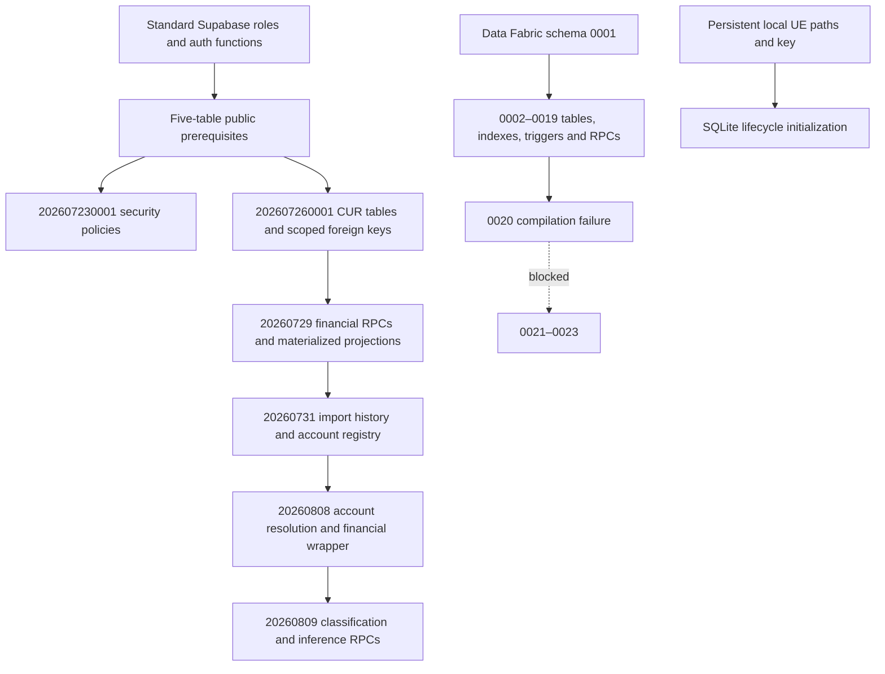

# CMP-P6-DEF-001 — Authoritative Blank-Database Bootstrap

**Status: BLOCKED. Recommendation: BLOCKED. Do not create staging or start P6-1B.**

The full requested bootstrap cannot be certified within the stated boundaries.
Two independently evidenced blockers remain: missing creation DDL for active
application objects, and a compilation failure in the protected Data Fabric
migration chain. This report does not equate passing Python tests with successful
fresh deployment.

## Root cause and reconstruction result

The dated public chain is incremental: its first file creates policies on five
existing tables, and later files depend on UUID organization identities and the
email-to-user tenant mapping. Historical dumps contain the five-table foundation,
but also obsolete functions, broad grants and unsafe policies. Other historical
scripts modify tables they never create, or include a literal tenant backfill.
There is no complete evidence-backed public application baseline in the repository.

A schema-only prerequisite file was reconstructed at
`supabase/bootstrap/public_prerequisites.sql`. It preserves the evidenced column
types/defaults and constraints, grants only the CRUD needed by the reconciled
policies, enables RLS before access, contains no seeds, and rejects a nonempty
public application schema. It is intentionally labelled **prerequisites only**;
it must not be mistaken for a complete application bootstrap. No dated migration
or Data Fabric file was edited, squashed, reordered or bypassed.

## Required public baseline objects and provenance

| Object | Original repository creation evidence | Preserved structure / dependencies |
| --- | --- | --- |
| organizations | backups/schema_v1.sql:1404 | UUID id PK with gen_random_uuid; name text NOT NULL; timestamp created_at; text status |
| users | backups/schema_v1.sql:1581 | UUID id PK; unique nonnull email; name/role text; UUID org_id FK to organizations; timestamp created_at |
| clients | backups/schema_v1.sql:703 | UUID id PK; name/industry/region text; timestamp created_at; UUID org_id FK |
| recommendations | backups/schema_v1.sql:1269 | UUID id PK and org_id FK; service/description/status/type/message/impact text; numeric estimated_savings; UUID client_id without an invented FK; created/resolved/completed timestamps |
| report_history | supabase/reporting_tables.sql:1 | UUID id PK; text org_id/tenant_id; report/delivery/status/recipient/file/notes fields; timestamptz created_at; two evidenced indexes |

The backup is evidence of historical creation, not proof of the original DEV
creation event or authority to replay it. `migration_master_normalization.sql`
also defines report_history and adds recommendation workflow columns; those
additional application contracts are outside the five-table prerequisite file
and remain part of the unresolved complete baseline. The five-table chain needs
no legacy views, RPCs or triggers before the first dated migration. UUID generation
uses the PostgreSQL core function; no extra extension was needed in local replay.
Supabase-provided postgres/anon/authenticated/service_role roles and auth.jwt(),
auth.role(), auth.uid() are platform prerequisites, not objects to recreate in a
real Supabase project.

## Historical SQL classification

The machine-readable inventory covers 112 SQL files (111 existing files plus the
new prerequisite file). Each has a classification, reason, hash, definitions,
structural object identifiers and qualified references. Totals: 88
CURRENT_REQUIRED, 8 UNSAFE_TO_REPLAY, 1 SUPERSEDED, 15 UNKNOWN. No file is declared
OPTIONAL or HISTORICAL_ONLY without sufficient evidence. CURRENT_REQUIRED means
required **evidence**, not permission to replay the file wholesale. Duplicate or
conflicting definitions still need resolution. UNKNOWN objects were retained,
not silently discarded. See the full file table below.

## Dependency graph

`schema_inventory.json` records each dated file's references and all discovered
creation providers recursively, including function-renaming dependencies:
`tenant_cloud_financial_posture_v1` and
`tenant_cloud_financial_posture_fg001_base` are created by renaming the prior
function, not missing bootstrap RPCs. Source offsets identify indexes, constraints,
added columns, policies and triggers. `local_catalog.json` supplements the lexical
graph with PostgreSQL-resolved columns/types/defaults, constraints, indexes,
policies, function signatures/configuration and triggers from the actual partial
replay. It is not a final expected application schema. PL/pgSQL dynamic dependencies
and unresolved application calls are explicitly not claimed fully certified.

## Application contract gaps

The Python AST inventory covers 244 literal database API calls and 152 dynamic
calls. String references to known objects are also retained to expose configuration
and table-name constants. These are conservative candidates: static references do
not prove route reachability, and schema-bound clients require namespace review.
The 34 distinct names below have no CREATE definition in the SQL inventory.

At least these are confirmed active public calls, rather than solely legacy names:
`repositories/application_repository.py:20` selects application_registry columns,
`:35` selects application_spend_mapping, and `:49` selects mart_application_spend;
`repositories/approval_repository.py:80` queries approval_requests and `:228`
queries approval_history. Technology repositories query technology_inventory,
while connector_tenancy.sql only alters it. Missing KPI/mart aggregation definitions
cannot be recovered from SELECT consumers without inventing business semantics.
Catching database exceptions and returning an empty list is not deployment proof.
Repository documentation and available SQL history did not supply these definitions.

- `alert_executions` — `backend/routes/alerts.py:376`
- `application_registry` — `repositories/application_portfolio_repository.py:19`
- `application_spend_mapping` — `repositories/application_repository.py:34`
- `approval_history` — `repositories/approval_repository.py:301`
- `approval_queue` — `repositories/dashboard_repository.py:100`
- `approval_requests` — `repositories/approval_repository.py:80`
- `cloud_connections` — `pages/cloud_connections.py:63`
- `connector_certification` — `repositories/enterprise_connector_repository.py:162`
- `connector_credential_vault` — `repositories/enterprise_connector_repository.py:58`
- `connector_quality_event` — `repositories/enterprise_connector_repository.py:145`
- `connector_sync_run` — `repositories/enterprise_connector_repository.py:101`
- `cost_uploads` — `pages/cost_upload_center.py:238`
- `enterprise_connector_registry` — `repositories/enterprise_connector_repository.py:35`
- `enterprise_cost_attribution` — `services/enterprise_cost_attribution_service.py:28`
- `enterprise_data_fabric` — `repositories/enterprise_connector_repository.py:122`
- `kpi_spend_by_cloud` — `utils/data_access_layer.py:443`
- `kpi_top_services` — `utils/data_access_layer.py:451`
- `kpi_total_cloud_spend` — `utils/data_access_layer.py:433`
- `mart_application_spend` — `repositories/application_repository.py:48`
- `mart_cost_anomalies` — `repositories/cost_intelligence_repository.py:34`
- `mart_enterprise_forecast` — `pages/reports.py:261`
- `mart_enterprise_spend` — `repositories/cost_intelligence_repository.py:10`
- `mart_enterprise_spend_v2` — `pages/reports.py:253`
- `mart_optimization_opportunities` — `repositories/cost_intelligence_repository.py:41`
- `mart_service_classification` — `repositories/service_explorer_repository.py:11`
- `notification_queue` — `services/escalation_service.py:74`
- `platform_health_history` — `repositories/platform_health_repository.py:31`
- `platform_health_snapshot` — `repositories/platform_health_repository.py:30`
- `platform_operations_log` — `repositories/platform_health_repository.py:59`
- `refresh_kpis` — `backend/jobs/tasks.py:130`
- `technology_inventory` — `repositories/ai_governance_repository.py:15`
- `vw_inactive_saas_users` — `repositories/technology_graph_repository.py:69`
- `vw_saas_renewal_risk` — `repositories/technology_graph_repository.py:55`
- `vw_vendor_spend` — `repositories/technology_graph_repository.py:41`

## Exact recorded deployment order (blocked, not executable)

The single machine-readable `migration_manifest.json` records every path and
SHA-256 over UTF-8 SQL with canonical LF newlines (portable across Git checkouts), and explicitly sets executable=false. Nothing may skip the incomplete
first step or the failing Data Fabric migration.

1. Complete reviewed public bootstrap: **missing**. The recovered
   `supabase/bootstrap/public_prerequisites.sql` is only the known five-table subset.
2. Apply these 17 existing public migrations in this exact order:

   - `supabase/migrations/202607230001_public_security_reconciliation.sql`
   - `supabase/migrations/202607260001_aws_cur_ingestion_foundation.sql`
   - `supabase/migrations/202607290001_enterprise_financial_data_fabric.sql`
   - `supabase/migrations/202607290002_optimize_enterprise_financial_posture.sql`
   - `supabase/migrations/202607290003_materialize_cloud_financial_projections.sql`
   - `supabase/migrations/202607290004_correct_persisted_fact_posture.sql`
   - `supabase/migrations/202607300001_bound_enterprise_financial_posture.sql`
   - `supabase/migrations/202607310001_add_import_history_billing_period.sql`
   - `supabase/migrations/202607310002_cloud_account_registry.sql`
   - `supabase/migrations/202608080001_fg002_account_resolution.sql`
   - `supabase/migrations/202608090001_p42_enterprise_classification.sql`
   - `supabase/migrations/202608090002_p42_owner_optional_resolution.sql`
   - `supabase/migrations/202608090003_p42_aws_user_tag_normalization.sql`
   - `supabase/migrations/202608090004_p42_inference_persistence_rpc.sql`
   - `supabase/migrations/202608090005_p42_persistence_lock_key.sql`
   - `supabase/migrations/202608090006_p42_batch_account_evidence.sql`
   - `supabase/migrations/202608090007_p42_single_scan_batch_evidence.sql`

3. Apply Data Fabric in this exact order (0020 currently blocks):

   - `migrations/data_fabric/0001_create_data_fabric_schema.sql`
   - `migrations/data_fabric/0002_create_enterprise_entities.sql`
   - `migrations/data_fabric/0003_create_entity_update_rpc.sql`
   - `migrations/data_fabric/0004_create_enterprise_relationships.sql`
   - `migrations/data_fabric/0005_create_entity_versions.sql`
   - `migrations/data_fabric/0006_create_lineage_events.sql`
   - `migrations/data_fabric/0007_create_provenance_records.sql`
   - `migrations/data_fabric/0008_create_relationship_update_rpc.sql`
   - `migrations/data_fabric/0009_create_quality_assessments.sql`
   - `migrations/data_fabric/0010_create_ontology_concepts.sql`
   - `migrations/data_fabric/0011_create_ontology_relationships.sql`
   - `migrations/data_fabric/0012_create_semantic_mappings.sql`
   - `migrations/data_fabric/0013_create_idempotency_records.sql`
   - `migrations/data_fabric/0014_create_ontology_update_rpcs.sql`
   - `migrations/data_fabric/0015_create_semantic_mapping_update_rpc.sql`
   - `migrations/data_fabric/0016_create_idempotency_state_rpcs.sql`
   - `migrations/data_fabric/0017_create_atomic_entity_write_rpc.sql`
   - `migrations/data_fabric/0018_create_atomic_relationship_write_rpc.sql`
   - `migrations/data_fabric/0019_create_stewardship_persistence.sql`
   - `migrations/data_fabric/0020_create_stewardship_rpcs.sql`
   - `migrations/data_fabric/0021_extend_relationship_authority.sql`
   - `migrations/data_fabric/0022_create_source_fact_authority.sql`
   - `migrations/data_fabric/0023_enforce_relationship_timestamp_order.sql`

4. Initialize Universal Evidence through the existing application startup
   initializer / SQLiteLifecycleRepository using
   `migrations/universal_evidence/0001_create_lifecycle_state.sql` on its persistent
   **local SQLite store**, never in Supabase. The existing ACT-009 documentation
   defines `NEXORA_UNIVERSAL_EVIDENCE_DB`; evidence paths/key and backup/checkpoint
   configuration remain operator prerequisites. This file is not evidence of
   PostgreSQL migration correctness.

## Local/ephemeral certification

A disposable PostgreSQL 18.3 instance was initialized inside `.tmp/def001-postgres`
and bound only to 127.0.0.1:55491. Docker's daemon was unavailable. Native pg_ctl
could not create a restricted token, so the local postgres process was launched
with a hidden window. No external connection or external credential was used.
Local auth.jwt/auth.role/auth.uid shims and standard role names allowed a limited
Postgres-compatible replay; these shims do not certify Supabase Auth or PostgREST.

| Check | Result |
| --- | --- |
| Blank database → prerequisite SQL | PASS |
| All 17 unchanged dated public migrations | PASS |
| Data Fabric 0001–0019 unchanged | PASS |
| Data Fabric 0020 | FAIL: function compilation |
| Data Fabric 0021–0023 | NOT RUN: fail-stop at 0020 |
| No seed rows after partial replay | PASS: all public/data_fabric tables empty |
| Synthetic two-tenant users/organization read isolation | PASS |
| Cross-tenant recommendation insert rejected | PASS |
| Final public financial-posture RPC invocation | PASS: authorized empty tenant returned one posture row |
| Nonempty schema bootstrap replay rejection | PASS |
| Complete frozen application schema | NOT CERTIFIED |
| Real Supabase RLS/RPC/PostgREST behavior | Deferred to separately authorized P6-1B after repository blockers are fixed |

Synthetic isolation rows were inserted inside a transaction and rolled back.
The exported catalog contains schema metadata only, not those rows. The disposable PostgreSQL server was shut down cleanly after the checks; no background database service remains running.

The reproducible error is in
`migrations/data_fabric/0020_create_stewardship_rpcs.sql:44`:
`if not case v_current.state when ... end then ...`.
PostgreSQL reports **syntax error at end of input** while compiling
`data_fabric.stewardship_transition_review`, with psql reporting the closing
statement at line 51. This is a parser failure, not missing client data or missing
Supabase roles. The first RPC in 0020 was created before that failure because the
file is not wrapped in a transaction; it is not a successfully applied migration.
The file was not modified, and later files were not used to disguise the failure.
A separately authorized correction to the protected migration is required.

## Regression and security results

- Focused migration/security tests: **64 passed**, 0 failures, no warnings in the final focused run.
- Final full repository suite: **1852 passed, 7 skipped, 0 failures**, 12 dependency deprecation warnings (154.62 seconds).
- Initial default-temp execution had 235 setup errors from Windows temp-directory
  permissions. A workspace-local basetemp resolved them; the earlier complete
  rerun passed 1851 tests with 7 skips. No product code was changed to make
  tests pass. Live Supabase integration variables were cleared for these runs.
- Secret / credential-pattern / client-confidential artifact scans: **PASS** for every added/modified deliverable; see `scan_results.json`. These are explicit local pattern scans, not a full-history third-party scanner certification.
- `git diff --check`: **PASS**; new-file whitespace scan also PASS.
- Data Fabric 0001–0023 and the dated public chain: unchanged; SHA-256 recorded.
- Required full-bootstrap coverage tests cannot honestly pass while the complete
  bootstrap is absent. Added tests instead prove the known prerequisites, no seed
  DML, fail-closed manifest, exact chain coverage/hashes, renamed dependencies,
  retained missing-object evidence and reproducible inventory. This is explicitly
  not a claim that all currently referenced public objects are represented.

## Files added / changed

- `supabase/bootstrap/public_prerequisites.sql`: reviewed prerequisite subset.
- `scripts/audit_database_bootstrap.py`: offline, reproducible inventory and manifest.
- `tests/security/test_database_bootstrap_audit.py`: focused release-gate regression.
- `docs/cmp/CMP-P6-DEF-001/`: report, inventory, blocked manifest, local catalog and scan results.
- `docs/NEXORA_DEPLOYMENT_GUIDE.md`: explicit fresh-project bootstrap gate.

Recreate inventory without credentials:
`python scripts/audit_database_bootstrap.py --output-dir docs/cmp/CMP-P6-DEF-001`.
This command never executes SQL and is not a deployment runner.

## Remaining engineering/operator prerequisites

Engineering must recover authoritative schema-only definitions for missing active
objects (including their keys, joins, tenant access and aggregation semantics),
resolve historical definition conflicts and dynamic table names, finish the one
complete bootstrap, and obtain scope authorization to correct the Data Fabric
0020 parser defect. An approved schema-only reference or prior migration source
can resolve missing semantics; runtime/client data is unnecessary and must not be
substituted for DDL. The operator is not being asked to assemble tables manually.
Then rerun the entire local chain before any staging recommendation.

Only after that repository gate passes: create a new dedicated staging project,
provide credentials securely, configure durable UE paths/key and backup/checkpoint,
and perform separately authorized external Supabase certification. No staging
project, REL-C1, AWS, Azure, P6-1B, external migration, commit or push was performed.

**Recommendation: BLOCKED.**

## Complete SQL classification table

| File | Classification |
| --- | --- |
| `archive/AI-CLOUD-ADVISOR_BACKUP/backup.sql` | UNSAFE_TO_REPLAY |
| `archive/AI-CLOUD-ADVISOR_BACKUP/clean_backup.sql` | UNSAFE_TO_REPLAY |
| `archive/AI-CLOUD-ADVISOR_BACKUP/local_backup.sql` | UNSAFE_TO_REPLAY |
| `backup_unused/backup.sql` | UNSAFE_TO_REPLAY |
| `backup_unused/clean_backup.sql` | UNSAFE_TO_REPLAY |
| `backup_unused/local_backup.sql` | UNSAFE_TO_REPLAY |
| `backups/schema_v1.sql` | UNSAFE_TO_REPLAY |
| `database/saas_governance_schema.sql` | CURRENT_REQUIRED |
| `migrations/data_fabric/0001_create_data_fabric_schema.sql` | CURRENT_REQUIRED |
| `migrations/data_fabric/0002_create_enterprise_entities.sql` | CURRENT_REQUIRED |
| `migrations/data_fabric/0003_create_entity_update_rpc.sql` | CURRENT_REQUIRED |
| `migrations/data_fabric/0004_create_enterprise_relationships.sql` | CURRENT_REQUIRED |
| `migrations/data_fabric/0005_create_entity_versions.sql` | CURRENT_REQUIRED |
| `migrations/data_fabric/0006_create_lineage_events.sql` | CURRENT_REQUIRED |
| `migrations/data_fabric/0007_create_provenance_records.sql` | CURRENT_REQUIRED |
| `migrations/data_fabric/0008_create_relationship_update_rpc.sql` | CURRENT_REQUIRED |
| `migrations/data_fabric/0009_create_quality_assessments.sql` | CURRENT_REQUIRED |
| `migrations/data_fabric/0010_create_ontology_concepts.sql` | CURRENT_REQUIRED |
| `migrations/data_fabric/0011_create_ontology_relationships.sql` | CURRENT_REQUIRED |
| `migrations/data_fabric/0012_create_semantic_mappings.sql` | CURRENT_REQUIRED |
| `migrations/data_fabric/0013_create_idempotency_records.sql` | CURRENT_REQUIRED |
| `migrations/data_fabric/0014_create_ontology_update_rpcs.sql` | CURRENT_REQUIRED |
| `migrations/data_fabric/0015_create_semantic_mapping_update_rpc.sql` | CURRENT_REQUIRED |
| `migrations/data_fabric/0016_create_idempotency_state_rpcs.sql` | CURRENT_REQUIRED |
| `migrations/data_fabric/0017_create_atomic_entity_write_rpc.sql` | CURRENT_REQUIRED |
| `migrations/data_fabric/0018_create_atomic_relationship_write_rpc.sql` | CURRENT_REQUIRED |
| `migrations/data_fabric/0019_create_stewardship_persistence.sql` | CURRENT_REQUIRED |
| `migrations/data_fabric/0020_create_stewardship_rpcs.sql` | CURRENT_REQUIRED |
| `migrations/data_fabric/0021_extend_relationship_authority.sql` | CURRENT_REQUIRED |
| `migrations/data_fabric/0022_create_source_fact_authority.sql` | CURRENT_REQUIRED |
| `migrations/data_fabric/0023_enforce_relationship_timestamp_order.sql` | CURRENT_REQUIRED |
| `migrations/universal_evidence/0001_create_lifecycle_state.sql` | CURRENT_REQUIRED |
| `scripts/anomalies_schema_migration.sql` | UNKNOWN |
| `supabase/01_etl_job_runs.sql` | CURRENT_REQUIRED |
| `supabase/02_mart_refresh_history.sql` | CURRENT_REQUIRED |
| `supabase/03_ai_model_registry.sql` | CURRENT_REQUIRED |
| `supabase/04_workspace_activity_log.sql` | CURRENT_REQUIRED |
| `supabase/05_data_quality_checks.sql` | UNKNOWN |
| `supabase/agentic_ai.sql` | CURRENT_REQUIRED |
| `supabase/ai_decision_history.sql` | CURRENT_REQUIRED |
| `supabase/ai_model_registry.sql` | CURRENT_REQUIRED |
| `supabase/ai_reasoning_engine.sql` | CURRENT_REQUIRED |
| `supabase/ai_recommendation_history.sql` | CURRENT_REQUIRED |
| `supabase/ai_workflow_actions.sql` | CURRENT_REQUIRED |
| `supabase/alerting_tables.sql` | CURRENT_REQUIRED |
| `supabase/approval_workflow.sql` | CURRENT_REQUIRED |
| `supabase/aws_connector_config.sql` | UNKNOWN |
| `supabase/aws_connector_persistence.sql` | CURRENT_REQUIRED |
| `supabase/aws_onboarding_templates.sql` | UNKNOWN |
| `supabase/bootstrap/public_prerequisites.sql` | CURRENT_REQUIRED |
| `supabase/business_capability_registry.sql` | CURRENT_REQUIRED |
| `supabase/business_digital_twin.sql` | UNKNOWN |
| `supabase/connector_certification_health.sql` | UNKNOWN |
| `supabase/connector_runtime_orchestration.sql` | UNKNOWN |
| `supabase/connector_status.sql` | CURRENT_REQUIRED |
| `supabase/connector_tenancy.sql` | UNSAFE_TO_REPLAY |
| `supabase/digital_twin_quality_history.sql` | CURRENT_REQUIRED |
| `supabase/enterprise_asset_correlation.sql` | CURRENT_REQUIRED |
| `supabase/enterprise_asset_identity.sql` | CURRENT_REQUIRED |
| `supabase/enterprise_asset_ownership.sql` | CURRENT_REQUIRED |
| `supabase/enterprise_compliance.sql` | CURRENT_REQUIRED |
| `supabase/enterprise_connector_platform.sql` | UNKNOWN |
| `supabase/enterprise_correlation_engine.sql` | UNKNOWN |
| `supabase/enterprise_data_quality.sql` | CURRENT_REQUIRED |
| `supabase/enterprise_identity_resolution.sql` | UNKNOWN |
| `supabase/enterprise_observability_platform.sql` | CURRENT_REQUIRED |
| `supabase/enterprise_ontology.sql` | UNKNOWN |
| `supabase/enterprise_scheduler.sql` | CURRENT_REQUIRED |
| `supabase/enterprise_security.sql` | CURRENT_REQUIRED |
| `supabase/etl_job_runs.sql` | CURRENT_REQUIRED |
| `supabase/execution_log.sql` | CURRENT_REQUIRED |
| `supabase/governance_authorization.sql` | CURRENT_REQUIRED |
| `supabase/governance_tables.sql` | CURRENT_REQUIRED |
| `supabase/impact_analysis_cache.sql` | CURRENT_REQUIRED |
| `supabase/learning_engine.sql` | CURRENT_REQUIRED |
| `supabase/mart_executive_summary_view.sql` | CURRENT_REQUIRED |
| `supabase/mart_refresh_history.sql` | CURRENT_REQUIRED |
| `supabase/metadata_catalog_lineage.sql` | UNKNOWN |
| `supabase/migration_master_normalization.sql` | CURRENT_REQUIRED |
| `supabase/migration_standardize_org_tenant_account.sql` | UNKNOWN |
| `supabase/migrations/202607230001_public_security_reconciliation.sql` | CURRENT_REQUIRED |
| `supabase/migrations/202607260001_aws_cur_ingestion_foundation.sql` | CURRENT_REQUIRED |
| `supabase/migrations/202607290001_enterprise_financial_data_fabric.sql` | CURRENT_REQUIRED |
| `supabase/migrations/202607290002_optimize_enterprise_financial_posture.sql` | CURRENT_REQUIRED |
| `supabase/migrations/202607290003_materialize_cloud_financial_projections.sql` | CURRENT_REQUIRED |
| `supabase/migrations/202607290004_correct_persisted_fact_posture.sql` | CURRENT_REQUIRED |
| `supabase/migrations/202607300001_bound_enterprise_financial_posture.sql` | CURRENT_REQUIRED |
| `supabase/migrations/202607310001_add_import_history_billing_period.sql` | CURRENT_REQUIRED |
| `supabase/migrations/202607310002_cloud_account_registry.sql` | CURRENT_REQUIRED |
| `supabase/migrations/202608080001_fg002_account_resolution.sql` | CURRENT_REQUIRED |
| `supabase/migrations/202608090001_p42_enterprise_classification.sql` | CURRENT_REQUIRED |
| `supabase/migrations/202608090002_p42_owner_optional_resolution.sql` | CURRENT_REQUIRED |
| `supabase/migrations/202608090003_p42_aws_user_tag_normalization.sql` | CURRENT_REQUIRED |
| `supabase/migrations/202608090004_p42_inference_persistence_rpc.sql` | CURRENT_REQUIRED |
| `supabase/migrations/202608090005_p42_persistence_lock_key.sql` | CURRENT_REQUIRED |
| `supabase/migrations/202608090006_p42_batch_account_evidence.sql` | CURRENT_REQUIRED |
| `supabase/migrations/202608090007_p42_single_scan_batch_evidence.sql` | CURRENT_REQUIRED |
| `supabase/performance_scalability.sql` | CURRENT_REQUIRED |
| `supabase/predictive_intelligence.sql` | CURRENT_REQUIRED |
| `supabase/recommendation_workflow_tables.sql` | UNKNOWN |
| `supabase/relationship_graph.sql` | CURRENT_REQUIRED |
| `supabase/reporting_tables.sql` | CURRENT_REQUIRED |
| `supabase/safe_execution.sql` | CURRENT_REQUIRED |
| `supabase/simulation_engine.sql` | CURRENT_REQUIRED |
| `supabase/technology_digital_twin.sql` | UNKNOWN |
| `supabase/technology_relationships_persistence.sql` | CURRENT_REQUIRED |
| `supabase/tenant_rls_policies.sql` | SUPERSEDED |
| `supabase/universal_entity_registry.sql` | CURRENT_REQUIRED |
| `supabase/workflow_builder.sql` | CURRENT_REQUIRED |
| `supabase/workflow_persistence.sql` | CURRENT_REQUIRED |
| `supabase/workspace_activity_log.sql` | CURRENT_REQUIRED |
| `supabase/workspace_health_status.sql` | CURRENT_REQUIRED |
