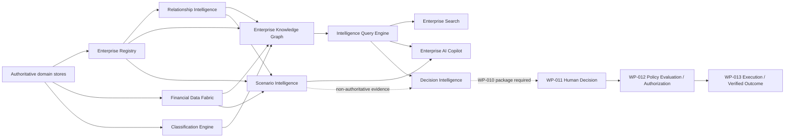
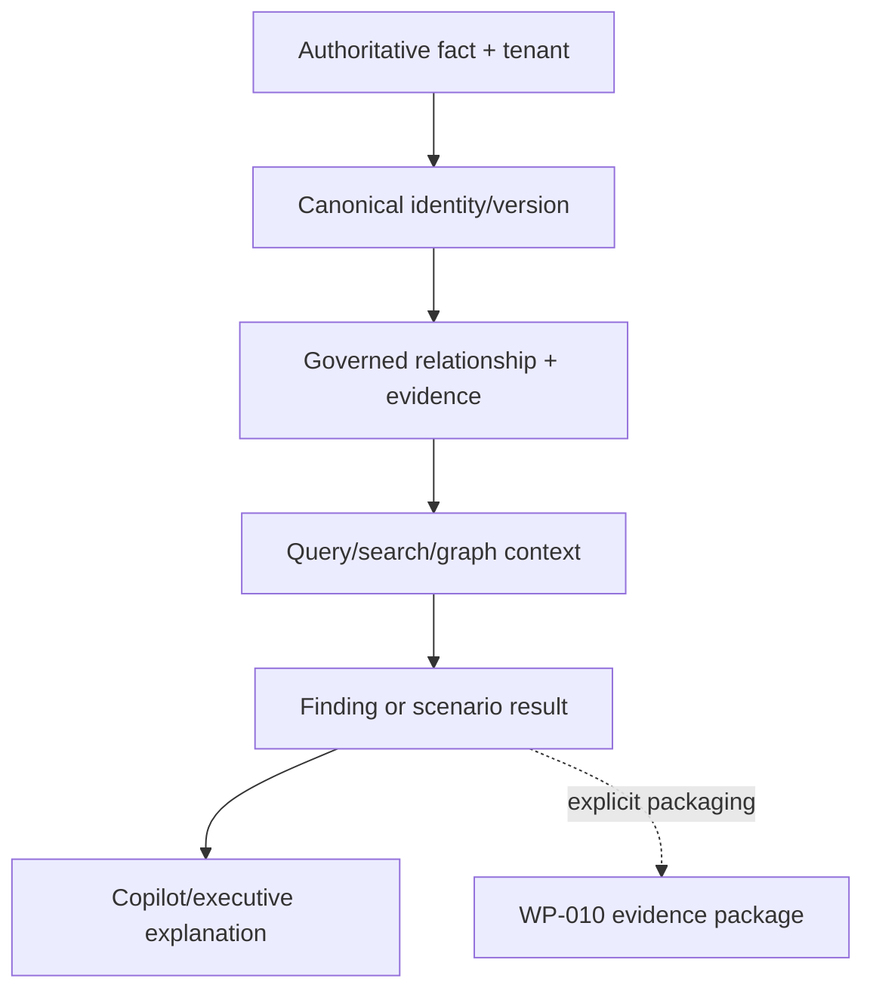

# P4.3 Enterprise Intelligence RC1 Architecture

All solid P4.3 edges through Scenario and Copilot are reads. The dotted scenario
edge cannot create a Decision; explicit WP-010 packaging is required. No P4.3
presentation or reasoning service owns provider-write credentials or an execution
interface.

## Evidence flow

At every derivation boundary the platform preserves tenant, canonical reference,
confidence, evidence or source reference, partial state, unknowns, and freshness
where supported.

## Runtime composition

Composition roots construct registry, relationships, graph, query, search, scenario,
and Copilot services. RC1 closes the previous optional-wiring gap by supplying
`ScenarioService` through the standard Copilot composition. This does not broaden
Copilot authority; it exposes only `simulate()` and deterministic explanation.
