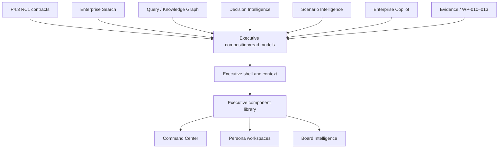
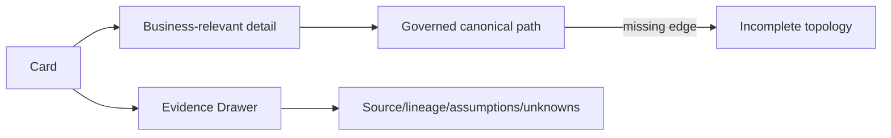
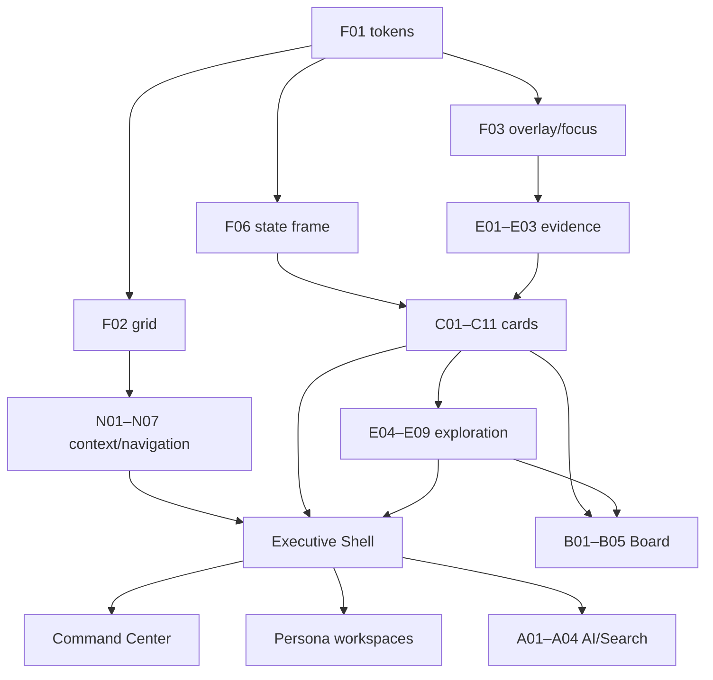

# P5.0.1 Executive UX Architecture

Status: **APPROVED DESIGN CHECKPOINT — IMPLEMENTATION NOT AUTHORIZED**

Approval disposition: Approved as the final P5 design checkpoint. Release Train 1
remains subject to the Product Freeze v2.0 entry gate and a bounded P5.1 engineering
package. The Nexora Component Catalog is the implementation contract prerequisite.

Product target: Nexora v2.0 Product Release Goal

## 1. Purpose

This checkpoint converts the frozen Product and UX specifications into a buildable
experience architecture. It defines component ownership, data composition, screen
structure, interactions, dependencies, and implementation order. It introduces no
new product formula or intelligence service.

## 2. Experience architecture



Executive composition is a non-authoritative read layer. It normalizes presentation
contracts and batching; it does not calculate unapproved scores/ranks or persist
domain truth.

## 3. Component inventory

### 3.1 Foundation primitives

| ID | Component | Responsibility | Depends on |
|---|---|---|---|
| F01 | Semantic tokens | Surface, text, status, authority, evidence, spacing, type | Existing design-system tokens |
| F02 | Responsive grid | 12/8/4/1-column layout and ordering | F01 |
| F03 | Focus/overlay foundation | Drawer/modal focus, escape, return, reduced motion | F01 |
| F04 | Icon and label vocabulary | Stable domain/status/authority semantics | F01 |
| F05 | Formatting | Currency, period, percentage, delta, count, freshness | Frozen financial/content rules |
| F06 | Component state frame | Loading, empty, partial, stale, conflict, unknown, unsupported, unauthorized, error | F01, F04 |

### 3.2 Context and navigation

| ID | Component | Required behavior |
|---|---|---|
| N01 | Executive page header | Workspace, purpose, persona, scope, period, Data Trust |
| N02 | Persona lens selector | Authorized lens only; never changes shared facts |
| N03 | Global filter bar | Scope/time/service/vendor filters; URL/export/narrative persistence |
| N04 | Breadcrumb/deep link | Canonical path, checkpoint and context preservation |
| N05 | Data Trust control | Coverage/freshness/unknowns summary; opens Evidence Drawer |
| N06 | Search launcher | Current authorized context into Executive Search |
| N07 | AI launcher | Visible removable context chips into Executive AI |

### 3.3 Executive cards

| ID | Component | Primary content |
|---|---|---|
| C01 | Executive Narrative Card | Structured brief, claims, drivers, consequence, trust |
| C02 | KPI Card | One value/state, delta, period, meaning, source, evidence |
| C03 | Health Card | Approved model/state, trend, factor, coverage, version |
| C04 | Risk Card | Consequence, scope, owner, trend, mitigation, evidence |
| C05 | Material Change Card | Change, magnitude, drivers, consequence, materiality rule |
| C06 | Attention Item | Priority, subject, consequence, owner, due/evidence state |
| C07 | Finding Card | Finding type/severity/evidence; no decision styling |
| C08 | Recommendation Card | Proposal, alternatives, value states, assumptions, actions |
| C09 | Scenario Card | Inputs, simulated impacts, unknowns, simulation banner |
| C10 | Decision Card | Actual WP-011 state, authority scope, evidence, next step |
| C11 | Outcome Card | WP-013 verified outcome and realized value evidence |

### 3.4 Explanation and exploration

| ID | Component | Responsibility |
|---|---|---|
| E01 | Evidence Indicator | Compact state/coverage/freshness/authority label |
| E02 | Evidence Drawer | Summary, Sources, Lineage, Assumptions, Unknowns, Raw Evidence |
| E03 | Factor Breakdown | Approved factor contributions/model version |
| E04 | Driver List | Deterministic ordered drivers with amounts/evidence |
| E05 | Relationship Path | Governed hops/evidence and incomplete-topology stop |
| E06 | Timeline | Events, occurred/observed times, source, authority, evidence |
| E07 | Comparison Matrix | Common baseline and scenario/entity dimensions; no implicit winner |
| E08 | Chart Panel | Business question, answer, chart, table, unit/period/source |
| E09 | Executive Table | Stable columns, sorting, pagination, row evidence/actions |

### 3.5 AI, Search, and Board

| ID | Component | Responsibility |
|---|---|---|
| A01 | Executive Answer Card | Direct governed answer, consequence, facts, unknowns, citations |
| A02 | AI Context Bar | Visible persona/scope/subject/time/filter chips |
| A03 | AI Response | Answer, claims, citations, trust, Explain/Compare/Simulate/Brief |
| A04 | Scenario Input Panel | Explicit immutable scenario inputs and assumptions |
| B01 | Report Builder | Type/scope/period/checkpoint/coverage validation |
| B02 | Review Workspace | Narrative tracked changes without fact mutation |
| B03 | Sign-off Panel | Reviewers, state, confidentiality, integrity |
| B04 | Presentation Template | Cover/divider/content/decision/appendix layouts |
| B05 | Evidence Appendix | Claim-to-source resolution and methodology |

## 4. Component contracts

Every component accepts a typed presentation contract containing subject/scope,
checkpoint/time, value/state, status, authority, evidence summary, partial/unknown
reasons, and allowed actions. Components do not receive repositories or raw provider
clients and do not derive business scores.

Recommended presentation contract families:

```text
ExecutiveContext
TrustSummary
MetricView
NarrativeView
AttentionView
FindingView
RecommendationView
ScenarioView
DecisionView
OutcomeView
EvidenceView
TimelineEventView
```

These are future additive UI contracts; exact fields require a bounded engineering
package and frozen contract review.

## 5. P4.3 service composition map

| P4.3 source | Components/surfaces fed | Permitted use | Prohibited use |
|---|---|---|---|
| Enterprise Registry | N03/N04, C02/C03, E05/E09, all subject headers | Canonical identity/version/ownership references | New identity authority |
| Relationship Intelligence | C04/C05, E05/E07, service/workspace impact | Governed paths and explicit zero-edge state | Invented topology/blast radius |
| Knowledge Graph | A01, service overview, dependency/financial context | Read-only composed context/evidence | New graph persistence |
| Query Engine | Cards, factors, business/financial/risk dimensions | Bounded facts/derived findings/partial states | Page-local query semantics |
| Enterprise Search | N06/A01, entity selection and navigation | Ranked canonical discovery | Second index/ranking engine |
| Enterprise Copilot | A03, C01 draft explanation | Grounded cited explanation | Scores, decisions, approval, execution |
| Decision Intelligence | C06–C08, attention and recommendations | Existing findings/proposals/priority | Second recommendation logic |
| Scenario Intelligence | C09, A04, E07 | Explicit analysis-only alternatives | Mutation or execution authority |
| Financial Data Fabric | C02/C05/E04/E08/E09/Board | Authoritative periods/spend/reconciliation | Derived authoritative totals |
| Classification | Trust, governance, ownership/classification views | Versioned classification state/evidence | UI inference |
| WP-010 Evidence | E01/E02/B05 | Approved package/evidence binding | Treating raw scenario as approved evidence |
| WP-011 Decision | C10, decisions queue/timeline | Actual human decision state | Rebranding proposals as decisions |
| WP-012 Policy | Decision/policy preview display | Preview vs evaluation/authorization state | Preview as authority |
| WP-013 Execution/Outcome | C11/timeline/Board | Execution and verified outcome/value | Projected value as realized |

## 6. Composition boundaries

Future `executive_experience` application services may batch frozen reads and map
them to view contracts. They must:

- require authenticated tenant/persona context;
- consume public P4.3 services through composition roots;
- preserve source checkpoints and partial/unknown semantics;
- apply entitlement before view/AI/export assembly;
- remain deterministic and read-only;
- cache only tenant/scope/checkpoint/entitlement-safe projections;
- return `UNSUPPORTED` for unapproved Decision Framework models;
- own no new recommendation, score, policy, or financial truth.

## 7. Shared shell wireframe

```text
┌──────────────────────────────────────────────────────────────────────┐
│ Nexora / Executive Experience      Persona ▾   Scope ▾   Period ▾   │
│ Workspace purpose                  Data Trust ◉   Search   Ask AI    │
├──────────────────────────────────────────────────────────────────────┤
│ Active filters: Enterprise · Current month vs prior month     Clear │
├──────────────────────────────────────────────────────────────────────┤
│ Page content using shared 12-column grid                            │
└──────────────────────────────────────────────────────────────────────┘
```

## 8. Executive Command Center wireframe

```text
┌ Enterprise posture ──────────────┬ Since last review ───────────────┐
│ State / score if approved        │ Structured 3–5 sentence brief    │
│ Trust · coverage · model version │ Drivers · consequence · evidence │
├ Business ┬ Financial ┬ Technology ┬ Risk/Cyber ┬ Governance ──────┤
│ State     │ State     │ State      │ State      │ State             │
│ driver    │ driver    │ driver     │ driver     │ driver            │
├ Attention required (max 5) ──────┬ Decisions waiting ──────────────┤
│ ranked evidence-backed items      │ actual WP-011 Decisions only    │
├ Forecast / outlook ───────────────┼ Today's material changes ───────┤
│ supported horizon/confidence      │ timeline/change cards           │
└ Evidence, unknowns, checkpoint, version metadata ──────────────────┘
```

Unapproved composite health/forecast/risk modules render `UNSUPPORTED` or are
replaced by supported source dimensions, as defined by Product Freeze v2.0.

## 9. Persona wireframes

### CEO

```text
Posture + Executive Brief
Critical business services | Financial performance | Business/vendor risk
Strategic initiatives and verified outcomes
Top decisions required | Board actions
Material-change timeline | Evidence
```

### CIO

```text
Technology/service posture + CIO Brief
Application lifecycle | Dependency/architecture risk | Ownership/standards
Technical debt* | Vendor concentration* | Modernization roadmap
Recommendations/scenarios | Decisions | Evidence
```

### CFO

```text
Reconciliation/Data Trust + Financial Brief
Enterprise/Cloud/SaaS/Vendor spend
Actual vs budget vs forecast* | Ranked cost drivers
Allocation/quarantine | Commitments/renewals*
Opportunity states → verified value | Decisions | Evidence
```

### Enterprise Architect

```text
Capability/service model coverage
Capability map | Service portfolio | Traceability
Dependency hotspots | Standards/lifecycle exceptions
Technical debt* | Transformation scenarios
Stewardship gaps | Evidence
```

### Operations

```text
Active impact + operational trust
Incidents/degradation | Health | Alerts/anomalies
Affected services/owners | Change calendar
Recommendations/policy preview | Approved work state
Connector freshness | Timeline/evidence
```

### FinOps

```text
Spend movement + financial trust
Drivers | Allocation/classification | Waste/rightsizing
Commitments* | Forecast* | Showback/chargeback
Opportunity lifecycle | Verified savings
Timeline/evidence
```

`*` Requires an approved Product Decision Record/model; otherwise unsupported.

## 10. Business-service drill-down wireframe

```text
Service identity · capability · owner · criticality* · trust
Health dimensions | Current attention/decision
Tabs:
Overview | Business | Technology | Dependencies | Financial
Risk | Timeline | Options | Evidence

Canonical path:
Enterprise → Unit → Capability → Service → Application
→ Technology → Cloud/Resource → Evidence
```

Each path hop shows relationship type and evidence; the flow stops explicitly at
missing governed topology.

## 11. Board Intelligence wireframe

```text
Report type · scope · period · confidentiality
Source checkpoint validation · reconciliation · coverage
Section outline and deterministic facts
Narrative draft with tracked changes
Evidence resolution and unknowns
Reviewer/sign-off state
PDF / PowerPoint native render preview
Integrity metadata and evidence appendix
```

## 12. Interaction flows

### Drill-down and evidence



Context preserved: persona, tenant scope, subject, filters, time, checkpoint, and
evidence entitlement.

### Search to explanation

```text
Search query → canonical Answer Card → business consequence
→ facts/unknowns/citations → service/entity detail → evidence or Ask AI
```

### AI handoff

```text
Visible page context → removable context chips → Ask/Explain/Compare
→ structured governed response → citations/unknowns
→ optional explicit Simulate or Draft Brief
```

AI cannot add hidden scope or expose Approve/Authorize/Execute.

### Recommendation to governed decision

```text
Finding → Recommendation Card → Compare/Simulate
→ Package Evidence → Open WP-011 Decision
→ Policy/Authorization owned workflow → Execution → Verified Outcome
```

Each transition is explicit; presentation does not skip states.

### Scenario comparison

```text
Select subject/type/options → inspect visible inputs/assumptions
→ run analysis only → baseline + up to 3 results
→ compare cost/risk/governance/impact/confidence/unknowns
→ optional evidence packaging; no automatic winner
```

## 13. Component dependency graph



## 14. Build order

1. Semantic tokens, formatting, state frame, focus/overlay
2. Evidence Indicator/Drawer and authority labels
3. KPI/Health/Risk/Material Change/Attention cards
4. Finding/Recommendation/Scenario/Decision/Outcome cards
5. Filter/context/navigation primitives
6. Timeline, driver/factor/path, tables, charts, comparison
7. Executive Shell and deep-link context
8. Command Center composition with supported facts only
9. Persona configuration and workspace compositions
10. Search/AI presentation integration
11. Board builder/review/templates/evidence/export
12. Cross-surface accessibility, visual, performance, browser, and security certification

This order minimizes rework by building evidence/state/authority foundations before
high-level pages.

## 15. PR and release-train decomposition

### RT1 — Component Library

Suggested bounded PR sequence:

1. semantic token additions and accessibility baseline;
2. state frame and authority/evidence indicators;
3. Evidence Drawer;
4. metric/health/risk/material-change cards;
5. finding/recommendation/scenario/decision/outcome cards;
6. timeline and relationship path;
7. filters/tables/charts/comparison;
8. component catalog, visual regression, and certification.

### RT2 — Executive Shell

Shell/context contracts, page header, persona lens, global filters, navigation/deep
links, Search/AI entry, responsive/accessibility certification.

### RT3 — Command Center

Executive read composition, first viewport, supported posture dimensions, attention,
actual decisions, material changes, trust/evidence, usability certification.

### RT4 — Persona Workspaces

CEO/CIO/CFO first, followed by Architect/Operations/FinOps; configuration-driven,
with cross-persona shared-truth and entitlement tests.

### RT5 — Board Intelligence

Report contracts, checkpoint validation, templates, narrative review, evidence,
sign-off, PDF/PPTX, native render/accessibility certification.

## 16. P5.0.1 approval gate

Before RT1 engineering:

- component inventory and dependency graph approved;
- P4.3 service composition map approved by owning domains;
- five priority prototypes (CEO, CIO, CFO, Board, Executive AI) visually approved;
- evidence entitlement and authority labels approved;
- semantic token/light-dark and accessibility strategy approved;
- unsupported P5-Dxx behavior confirmed;
- P4.3 manual browser-gate disposition recorded;
- bounded RT1/first-PR engineering package issued.

## 17. Explicit exclusions

This checkpoint does not authorize UI code, new services/contracts, business
formulas, migrations, Production access, PR merge, release, tag, or autonomous
behavior. It is the architecture input to the next separately authorized work.
