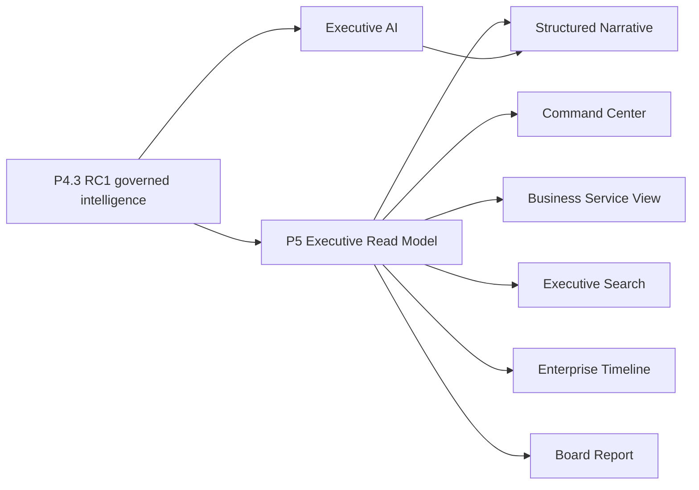

# P5 Executive Intelligence Product Blueprint

Status: **DESIGN BASELINE — IMPLEMENTATION NOT AUTHORIZED**

Foundation: P4.3 Enterprise Intelligence RC1

Audience: Product, design, architecture, engineering, security, and executive sponsors

## Product promise

Nexora should let an executive understand enterprise posture in 30 seconds,
understand why it changed in two minutes, and enter a governed decision workflow
without losing evidence or authority boundaries.

The differentiator is not another dashboard. It is a single traceable story from
business outcome to service, application, technology, cloud, cost, owner, risk,
evidence, scenario, recommendation, and human decision.

## Design principles

1. **Lead with change and consequence.** Show what changed, why it matters, and
   what requires attention before showing inventory totals.
2. **Business first.** Default to business services, outcomes, portfolios, and
   decisions; infrastructure remains drill-down evidence.
3. **One truth, different lenses.** Personas share the same governed facts and
   calculations. They differ in priority, vocabulary, depth, and permitted actions.
4. **Narrative plus proof.** Every executive statement must open its drivers,
   confidence, freshness, unknowns, and source evidence.
5. **Separate signal from authority.** Insights, AI explanations, simulations, and
   recommendation proposals never imply approval or execution.
6. **No false precision.** Missing topology, stale data, unreconciled finance, and
   unsupported forecasts remain visibly partial or unknown.
7. **Decision density, not screen density.** The first viewport contains only the
   enterprise posture, material changes, and decisions requiring attention.
8. **Progressive disclosure.** Board language first; governed technical detail is
   always reachable without overwhelming the initial view.

## The first 30 seconds

Every command center uses the same visual grammar:

```text
Enterprise posture + freshness + coverage
                ↓
Material change narrative
                ↓
Five health dimensions
                ↓
Top attention items / decisions required
                ↓
Role-specific story and drill-down
```

The opening viewport answers exactly five questions:

1. Is the enterprise healthy?
2. What materially changed?
3. What is the business and financial consequence?
4. What evidence is incomplete?
5. What needs my attention—not merely my awareness?

### Shared opening components

| Component | Purpose | Required semantics |
|---|---|---|
| Enterprise Health | Calm composite posture, not a vanity score | Dimension breakdown, policy/version, coverage, confidence |
| Since Last Review | Material change summary | Baseline checkpoint, comparison period, drivers |
| Attention Required | Maximum five ranked items | Severity, consequence, owner, due date, evidence state |
| Decisions Required | Human decision queue | Decision state and authority; never inferred from recommendations |
| Data Trust | Trustworthiness of the view | Freshness, topology, classification, reconciliation, unknowns |

## Persona experiences

### CEO / Executive

**Primary question:** Are enterprise outcomes at risk, and which decisions require
leadership attention?

First view:

- enterprise health and material movement;
- business services at risk and affected outcomes;
- forecast versus strategic plan;
- top vendor or concentration exposures;
- investment value at risk and verified realized value;
- decisions requiring executive authority;
- a five-sentence board-level narrative.

Default language: business impact, resilience, exposure, investment, decision.
Hide by default: resource SKUs, connector operations, raw policy inputs, technical
alerts. CEO drill-down stops at business service unless evidence is requested.

### CIO

**Primary question:** Is the technology estate resilient, governed, affordable,
and aligned to business priorities?

First view:

- technology and business-service health;
- critical dependency and lifecycle exposure;
- ownership, classification, and architecture coverage;
- application and vendor concentration;
- technical debt trend;
- change-impact and scenario summaries;
- decisions and investment trade-offs.

Default language: service resilience, portfolio health, lifecycle, dependency,
technical debt, transformation, governance.

### CFO / Finance Head

**Primary question:** Are we financially controlled, on plan, and realizing approved
value?

First view:

- reconciled enterprise spend and data-trust status;
- actual, budget, forecast, and variance with drivers;
- allocated, unallocated, and quarantined spend;
- potential versus approved versus executed versus verified realized savings;
- unit economics by business service or portfolio;
- commitment, vendor, renewal, and concentration exposure;
- financial decisions requiring authority.

Default language: plan, variance, exposure, allocation, commitment, realized value.
No projected saving may appear in the realized-value position.

### Enterprise Architect

**Primary question:** Where is the operating model structurally fragile, redundant,
or misaligned?

First view:

- capability-to-service-to-application coverage;
- orphaned, duplicated, obsolete, or high-dependency applications;
- technology standards and lifecycle exceptions;
- business-service dependency hotspots;
- vendor and platform concentration;
- transformation scenarios and roadmap impact;
- evidence gaps that block architectural conclusions.

Default language: capability, service, application, standard, lifecycle,
dependency, target state. This persona receives analysis, not execution authority.

### Cloud Operations Manager

**Primary question:** What is changing now, what can disrupt service, and who owns
the response?

First view:

- active service degradation and operational risk;
- anomalies, incidents, changes, and connector/data freshness;
- affected applications and business services;
- accountable owners and escalation status;
- operational recommendations and policy preview;
- approved work awaiting execution through existing governed pathways.

Default language: impact, incident, change, owner, mitigation, evidence, status.
Operational detail is prominent; strategic financial storytelling is secondary.

### FinOps

**Primary question:** What drove cost, who owns it, and which governed opportunities
can move from potential to verified value?

First view:

- cost movement and ranked drivers;
- allocation and classification coverage;
- forecast and budget variance;
- anomalous or unit-cost movement;
- opportunity pipeline by governance state;
- commitment and utilization posture;
- realized-value verification.

Default language: driver, allocation, unit cost, forecast, opportunity, approval,
realization. FinOps sees detailed financial evidence but receives no simulation-
derived execution authority.

## Shared product surfaces

### 1. Executive Command Center

One shell with persona presets, not separate data products. It provides:

- health header;
- material-change narrative;
- five dimension cards: Business, Financial, Technology, Risk, Governance;
- attention and decision queues;
- trend strip;
- trust/evidence drawer;
- saved executive lens and time comparison.

### 2. Executive Narratives

A narrative is a structured product, not free-form LLM prose:

```text
Observation → magnitude/timeframe → ranked drivers → consequence
→ recommendation/proposed alternatives → unknowns → evidence
```

Required fields include narrative ID/version, tenant, audience, checkpoint,
materiality rule, facts, derived claims, evidence references, confidence, freshness,
unknowns, generated time, and `authoritative = false` for AI interpretation.
The LLM may improve language but may not change amounts, drivers, assumptions,
ranking, or authority state.

### 3. Business Service Intelligence

The business service becomes the default executive drill-down:

```text
Outcome / capability
  └─ Business service
      ├─ owners and consumers
      ├─ applications and technologies
      ├─ cloud/resources and vendors
      ├─ current and forecast cost
      ├─ health, risk, incidents, lifecycle
      ├─ governed dependencies and blast radius
      ├─ findings, recommendations, scenarios, decisions
      └─ evidence, unknowns, freshness
```

The page must not invent missing connections. An incomplete chain is a first-class
trust signal and a stewardship prompt, not a hidden empty state.

### 4. Executive Search

Search returns an answer card before raw matches:

- canonical subject and aliases;
- why it matched;
- business context and owner;
- health, cost, risk, dependencies, policy/findings;
- concise AI explanation;
- evidence and unknowns;
- persona-appropriate next steps.

It reuses P4.3 Search, Query, Graph, and Copilot. It does not create a new index or
retrieval framework during P5.

### 5. Enterprise Timeline

The timeline explains enterprise change across governed checkpoints:

- cost and forecast movements;
- ownership/classification changes;
- relationship or topology changes;
- incidents and service-health changes;
- findings, recommendation versions, human decisions, authorizations, executions,
  and verified outcomes;
- evidence freshness and coverage changes.

Events keep their original authority level. A narrative about an event is not the
event itself.

### 6. Enterprise Risk Center

Risk is organized by business consequence, not source-tool category:

- resilience and dependency;
- financial and vendor concentration;
- ownership and governance;
- lifecycle and technical debt;
- security/cyber exposure where authoritative evidence exists;
- data/evidence risk.

Every risk shows affected services, exposure, trend, owner, evidence quality,
mitigation status, and scenario alternatives. Unsupported cyber or risk models must
show `UNKNOWN`, never a synthetic score.

### 7. Executive AI Workspace

Executive AI supports ask, explain, compare, brief, and simulate. It may:

- retrieve governed enterprise context;
- explain material changes;
- compare evidence-backed alternatives;
- call Scenario Intelligence with explicit visible inputs;
- draft a board narrative or report section.

It may not silently alter assumptions, create Decisions, approve policy, execute
actions, or claim projected value as realized.

### 8. Board Report

The board report is a signed, checkpointed presentation artifact—not a screenshot
of the dashboard.

Required sections:

1. Executive summary and material changes
2. Enterprise health and data trust
3. Financial performance and outlook
4. Business-service and resilience risk
5. Technology portfolio and technical debt
6. Vendor/renewal/concentration exposure
7. Recommendations and alternatives
8. Decisions made and decisions required
9. Verified outcomes and realized value
10. Evidence appendix, assumptions, unknowns, and methodology

Operational workspaces retain raw incidents, queues, connector logs, detailed cost
records, and execution controls. Board reports contain summarized consequence,
trend, governance state, and explicit asks.

## Information hierarchy and navigation

Recommended P5 navigation:

```text
Executive Intelligence
├─ Command Center
├─ Business Services
├─ Enterprise Risk
├─ Enterprise Timeline
├─ Executive Search
├─ Executive AI
└─ Board Reports
```

Persona presets alter ordering and defaults but not the canonical URLs or contract
semantics. Deep links preserve subject, checkpoint, persona-safe view, and evidence
context.

## Health model

Do not launch a universal health score without a versioned policy. RC1 sources feed
five separately visible dimensions:

| Dimension | Candidate inputs | Required guardrail |
|---|---|---|
| Business | critical-service health, impact, ownership | topology/coverage disclosed |
| Financial | reconciliation, budget/forecast, allocation | authoritative financial periods only |
| Technology | lifecycle, dependency, operational health | no missing-data-as-zero |
| Risk | governed risk signals and concentration | unsupported dimensions remain unknown |
| Governance | classification, ownership, policy/evidence | authority state stays separate |

An optional composite may be derived only after owners approve weights,
materiality thresholds, missing-data treatment, and versioning. Until then, display
the five dimensions without collapsing them into false precision.

## Prioritization model

Attention ranking must be deterministic and explainable. Candidate factors:

- business criticality and blast radius;
- financial materiality;
- risk severity and trend;
- evidence confidence and freshness;
- governance urgency;
- decision due date;
- persona relevance.

P4.3.7 priority scoring is the starting contract. P5 may add a persona view of the
score but must not create a second findings/ranking engine.

## Differentiation thesis

Nexora should be positioned around four product behaviors:

1. **Business-to-cloud traceability:** move from an executive outcome to its cost,
   technology, dependency, owner, and evidence in one governed chain.
2. **Truthful uncertainty:** make incomplete topology, stale evidence, and
   unreconciled finance visible instead of manufacturing confidence.
3. **Decision continuity:** preserve the chain from fact to narrative, scenario,
   recommendation, human decision, policy, execution, and verified outcome.
4. **Integrated value story:** show potential, approved, executed, and verified
   realized value without collapsing them into one savings claim.

These are product positioning hypotheses. Competitive claims against named vendors
require a separate, sourced market-validation exercise before external use.

## Architecture boundaries

P5 is a presentation and composition layer over frozen RC1 contracts:



P5 must not introduce another registry, financial model, graph, query/search engine,
scenario framework, finding/recommendation engine, policy engine, or execution
contract. Read models may cache derived presentation data but never become an
authoritative domain store.

## Product telemetry and success measures

| Outcome | Measure |
|---|---|
| 30-second comprehension | User identifies posture and top issue without navigation |
| Decision focus | Ratio of material attention items opened or dispositioned |
| Trust | Evidence drawer usage and low rate of disputed facts |
| Narrative usefulness | Executive edits required before board use |
| Time to answer | Time from question to evidence-backed explanation |
| Business adoption | Business-service views versus infrastructure-only views |
| Value integrity | Zero projected-as-realized defects |
| Safety | Zero authority or tenant-boundary regressions |

Telemetry must not record secrets, raw prompts containing sensitive data, or
cross-tenant identifiers.

## Accessibility and visual acceptance

- Meet WCAG 2.2 AA for contrast, keyboard access, focus, labels, and non-color status.
- First viewport works at standard executive laptop resolution without horizontal
  scrolling.
- No more than five primary attention items.
- Status always includes text/icon, not color alone.
- Currency, period, source, and freshness appear near financial values.
- Charts answer a named question and expose an accessible tabular equivalent.
- Exported board artifacts pass page-by-page visual QA.

## Proposed delivery sequence

### P5.0 — Product and contract certification

- approve persona journeys and vocabulary;
- approve health/materiality policies;
- define the Executive Read Model and Narrative contract;
- validate required RC1 data coverage;
- produce wireframes and usability-test scripts.

### P5.1 — Executive Command Center

- shared shell and persona presets;
- opening posture, material changes, attention, decisions, and trust;
- CEO, CIO, and CFO first; remaining personas after validation.

### P5.2 — Business Service Intelligence and Executive Search

- business-service golden path;
- executive answer cards and cross-domain drill-down;
- incomplete-topology stewardship experience.

### P5.3 — Narratives, Timeline, and Executive AI

- structured deterministic narratives;
- governed temporal story;
- ask/explain/compare/brief/simulate interactions.

### P5.4 — Enterprise Risk Center and Board Reporting

- consequence-oriented risk portfolio;
- checkpointed PowerPoint/PDF board package;
- consolidated accessibility, visual, security, and performance release gate.

## Required design decisions before coding

Product owners must explicitly approve:

1. CEO/CIO/CFO top-five measures and materiality thresholds.
2. Whether an enterprise composite health score is allowed and its versioned policy.
3. Business-service criticality vocabulary and accountable owner semantics.
4. Forecast periods and which models are valid for executive presentation.
5. Vendor concentration and technical-debt definitions.
6. Decision urgency and escalation rules.
7. Board-report audience, cadence, sign-off, retention, and confidentiality.
8. Persona entitlement matrix for evidence depth and financial detail.
9. Executive narrative tone, length, and human-review requirements.
10. Market positioning claims after sourced competitive validation.

## P5 entry gate

Implementation begins only when:

- this blueprint is approved;
- the ten design decisions above have owners;
- CEO, CIO, and CFO wireframes pass stakeholder review;
- the Executive Read Model and Narrative contracts are authorized;
- P4.3 RC1 remains the single intelligence foundation;
- manual P4.3 browser certification disposition is recorded;
- a bounded P5.0 engineering package is issued.

Until then, no Executive Intelligence implementation should begin.
